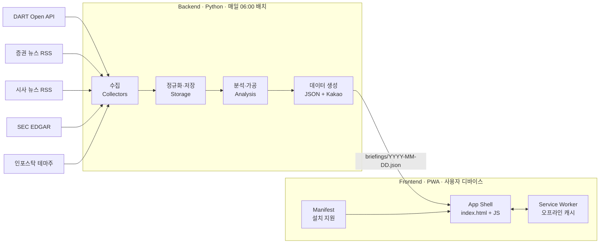
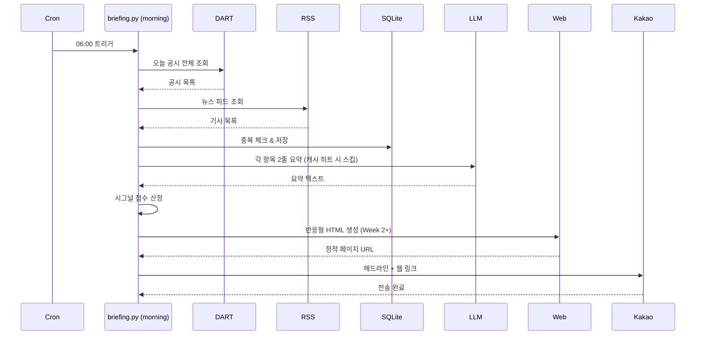
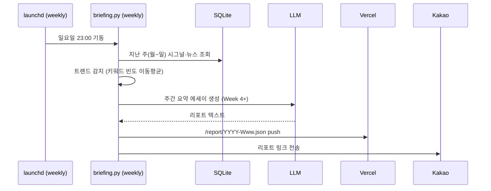

# 시스템 아키텍처

## 1. 고수준 구조

시스템은 **백엔드 (데이터 파이프라인)** 와 **프론트엔드 (PWA 앱 셸)** 두 축으로 구성된다. 둘은 JSON 데이터 파일로 느슨하게 결합된다.



### 1.1 레이어 책임

| 레이어 | 책임 | 주요 컴포넌트 |
|--------|------|--------------|
| Collectors | 외부 소스에서 원시 데이터 수집, 정규화된 형태로 저장. 증권/시사 구분 | `collectors/dart.py`, `collectors/rss_stock.py`, `collectors/rss_current.py`, `collectors/edgar.py` |
| Storage | 중복 제거, 요약·주석 캐시, 영속 상태 관리 | SQLite (`briefing.db`) |
| Analysis | LLM 기반 요약·주석, 시그널 스코어링, 테마 분석, 시사 큐레이션 | `analysis/llm.py`, `analysis/scoring.py`, `analysis/glossary.py`, `analysis/curation.py`, `analysis/valuechain.py` |
| Delivery (백엔드) | JSON 데이터 파일 생성, 카카오톡 메시지 발송 | `delivery/json_builder.py`, `delivery/kakao.py` |
| Frontend (PWA) | 앱 셸, 데이터 렌더링, 오프라인·설치 지원 | Next.js 15 static export + React + Tailwind, `frontend/` 디렉토리 |

## 2. 데이터 흐름

### 2.1 아침 브리핑 (하루 1회, 06:00)



### 2.2 주간 리포트 생성 (일요일 23:00)



**실시간 장중 폴링은 구현하지 않는다.** `PRD.md` 2.5 Non-goals 참조. 이 프로덕트는 아침 배치 브리핑 + 주간 리포트에 집중한다.

## 3. 기술 스택과 선택 이유

### 3.1 언어·프레임워크

| 영역 | 선택 | 이유 |
|------|------|------|
| 백엔드 | Python 3.11+ | DART/카카오 API, feedparser, 금융 라이브러리 생태계 풍부 |
| 프론트엔드 | PWA (HTML/CSS/JS + manifest + service worker) | 데스크탑·모바일 단일 코드, 설치·오프라인 지원. 네이티브 앱 불필요 |
| 프론트엔드 빌드 | Next.js 14 + `next-pwa` **또는** 정적 HTML + Tailwind CDN + vanilla SW | Week 2 착수 시 복잡도 판단. 정적 HTML이 기본, 기능 확장되면 Next.js 전환 |
| 호스팅 | Vercel 무료 티어 | 자동 HTTPS (PWA 필수), GitHub push 자동 배포, 커스텀 도메인 무료 |
| 스케줄러 | macOS launchd | cron 대비 sleep 복구에 안정적 |
| DB | SQLite | 로컬 단일 사용자, 백업·이식 간단 |

### 3.2 LLM 전략

**주 엔진: Claude Code CLI (Max 플랜 호출)**

- Max $100 플랜 할당량을 그대로 사용 (API 별도 과금 없음)
- Python에서 `subprocess.run(["claude", "-p", prompt, "--output-format", "json"])` 로 호출
- `ANTHROPIC_API_KEY` 환경 변수가 설정돼 있으면 구독 대신 API 과금 발생 → 반드시 제거
- 단점: Anthropic 공식 Python SDK는 Max 플랜 미지원, CLI wrapping 필요

**보조 엔진: Ollama 로컬**

- 대량 반복 작업용 (용어 주석 사전 생성, 단순 제목 정리)
- Max 한도 초과 자동 fallback
- 권장 모델: `qwen2.5:14b` (한국어 품질 양호) 또는 `llama3.1:8b`

**하이브리드 원칙**

| 작업 | 엔진 | 이유 |
|------|------|------|
| 뉴스·공시 2줄 요약 | Claude | 품질 차이 큼, 빈도 낮음 (하루 수십 건) |
| 용어 주석 생성 (최초) | Claude | 공시 유형당 한 번만 생성 후 DB 캐시 |
| 용어 주석 조회 | DB 캐시 | LLM 호출 불필요 |
| 밸류체인 분석 | Claude | 복잡한 추론 필요 |
| 반복 구조화 (JSON 추출 등) | Ollama 가능 | 품질 민감도 낮음 |

### 3.3 외부 API

| 서비스 | 용도 | 비용 | 제한 |
|--------|------|------|------|
| DART Open API | 국내 전자공시 | 무료 | 10,000 req/일 |
| 카카오 OAuth + Memo | 본인 카카오톡 전송 | 무료 | 4KB/메시지, talk_message scope |
| SEC EDGAR (Week 2+) | 미국 filings | 무료 | 10 req/초 |
| 네이버 금융 (크롤링, Week 3+) | 수급 데이터 | 무료 | robots.txt 준수, 완만한 속도 |
| 인포스탁 (크롤링, Week 3+) | 테마주 분류 | 무료 | 마찬가지 |

## 4. 디렉토리 구조 (권장)

```
news_briefing/
├── CLAUDE.md                 # Claude Code 프로젝트 가이드
├── README.md                 # 프로젝트 개요
├── docs/                     # 설계 문서
│   ├── PRD.md
│   ├── ARCHITECTURE.md
│   ├── ROADMAP.md
│   └── SIGNALS.md
├── pyproject.toml            # 프로젝트 메타 & 의존성 (uv 권장)
├── .env.example
├── .gitignore                # .env, .kakao_tokens.json, *.db 제외
│
├── src/
│   └── news_briefing/
│       ├── __init__.py
│       ├── config.py         # 환경 변수 로딩, 상수
│       ├── cli.py            # 엔트리 포인트 (morning/weekly/dryrun)
│       │
│       ├── collectors/
│       │   ├── __init__.py
│       │   ├── base.py       # 공통 인터페이스
│       │   ├── dart.py
│       │   ├── rss.py
│       │   └── edgar.py      # Week 2+
│       │
│       ├── storage/
│       │   ├── __init__.py
│       │   ├── db.py         # SQLite 연결·스키마
│       │   ├── seen.py       # 중복 제거
│       │   └── cache.py      # LLM 응답 캐시
│       │
│       ├── analysis/
│       │   ├── __init__.py
│       │   ├── llm.py        # Claude CLI / Ollama switcher
│       │   ├── scoring.py    # 시그널 점수 산정
│       │   ├── glossary.py   # 용어 주석 (Week 2+)
│       │   └── valuechain.py # 테마·밸류체인 (Week 3+)
│       │
│       └── delivery/
│           ├── __init__.py
│           ├── kakao.py      # 나에게 보내기 + 토큰 관리
│           ├── kakao_auth.py # OAuth 1회 스크립트
│           └── web.py        # JSON 데이터 + PWA 빌드 (Week 2+)
│
├── templates/                # Jinja2 HTML 템플릿 (Week 2+)
│   ├── briefing.html
│   └── card.html
│
├── data/                     # 런타임 데이터 (gitignore)
│   ├── briefing.db
│   ├── digests/              # 일자별 백업
│   └── web/                  # 생성된 JSON 호스팅 디렉토리
│
├── scripts/
│   ├── com.user.news-briefing.morning.plist     # 평일 06:00
│   └── com.user.news-briefing.weekly.plist      # 일요일 23:00 (Week 4+)
│
└── tests/
    ├── test_scoring.py
    └── test_collectors.py
```

## 5. 핵심 데이터 모델

### 5.1 `seen` 테이블

중복 알림 방지. 한 번 처리한 항목은 다시 알림 보내지 않는다.

```sql
CREATE TABLE seen (
    source TEXT NOT NULL,      -- 'dart', 'rss:hankyung', 'edgar' 등
    ext_id TEXT NOT NULL,      -- DART rcept_no, RSS guid 등
    seen_at TEXT NOT NULL,     -- ISO 8601
    PRIMARY KEY (source, ext_id)
);
CREATE INDEX idx_seen_time ON seen(seen_at);
```

### 5.2 `llm_cache` 테이블

같은 내용에 대해 LLM을 중복 호출하지 않는다.

```sql
CREATE TABLE llm_cache (
    content_hash TEXT PRIMARY KEY,   -- SHA256(task + input)
    task TEXT NOT NULL,              -- 'summarize', 'glossary', 'valuechain'
    output TEXT NOT NULL,
    model TEXT NOT NULL,             -- 'claude-cli', 'ollama:qwen2.5:14b'
    created_at TEXT NOT NULL
);
```

### 5.3 `glossary` 테이블 (Week 2+)

공시 유형별 용어 해설.

```sql
CREATE TABLE glossary (
    term TEXT PRIMARY KEY,       -- '임원·주요주주특정증권등소유상황보고서'
    short_label TEXT NOT NULL,   -- '내부자 매매'
    explanation TEXT NOT NULL,   -- 3~4줄 해설
    signal_direction TEXT,       -- 'positive'|'negative'|'neutral'|'mixed'
    updated_at TEXT NOT NULL
);
```

### 5.4 `theme_valuechain` 테이블 (Week 3+)

테마-밸류체인-기업 매핑.

```sql
CREATE TABLE themes (
    theme_id TEXT PRIMARY KEY,       -- 'robotics', 'ai_chip'
    name_ko TEXT NOT NULL,
    description TEXT
);

CREATE TABLE value_layers (
    layer_id INTEGER PRIMARY KEY AUTOINCREMENT,
    theme_id TEXT NOT NULL REFERENCES themes(theme_id),
    name TEXT NOT NULL,              -- '액추에이터', '센서', '제어·AI'
    description TEXT
);

CREATE TABLE companies_in_layer (
    layer_id INTEGER REFERENCES value_layers(layer_id),
    ticker TEXT NOT NULL,            -- '005930', 'NVDA' 등
    company_name TEXT NOT NULL,
    positioning TEXT,                -- LLM 생성: "이 회사가 왜 이 레이어에 속하는지"
    PRIMARY KEY (layer_id, ticker)
);
```

## 6. PWA 프론트엔드 아키텍처 (F16, F25, F26)

### 6.1 구조 개요

백엔드가 매일 JSON 데이터를 생성하고, 프론트엔드는 **단일 앱 셸** 이 이 JSON을 받아 렌더링한다. 사용자는 앱처럼 느끼지만 실제로는 웹 기술.

```
사용자 디바이스
├─ App Shell (index.html + JS bundle)   ← 한 번 로드 후 캐시
├─ Service Worker (sw.js)               ← 오프라인 요청 가로채서 캐시 응답
└─ Manifest (manifest.json)             ← 홈 화면 설치 메타데이터

서버 (Vercel/GitHub Pages)
├─ /briefings/2026-04-21.json           ← 오늘 데이터
├─ /briefings/2026-04-20.json           ← 어제
├─ /briefings/index.json                ← 날짜 목록
└─ /static/...                          ← 정적 리소스
```

### 6.2 스택

| 영역 | 선택 | 이유 |
|------|------|------|
| 프레임워크 | Next.js 15 (static export) | App Router, static generation, PWA 플러그인 성숙 |
| UI | React 19 + Tailwind CSS | `DESIGN.md` 참고 코드가 React 기반 |
| 상태 | React hooks + SWR (데이터 페칭) | SWR이 오프라인·캐시 처리 자연스러움 |
| PWA | `next-pwa` 또는 수동 SW | manifest + service worker 자동화 |
| 호스팅 | Vercel 무료 티어 | HTTPS 필수, 자동 배포 |

### 6.3 프론트엔드 디렉토리 구조

```
frontend/
├── package.json
├── next.config.js              # static export, PWA 설정
├── tailwind.config.js          # DESIGN.md 팔레트 반영
├── public/
│   ├── manifest.json
│   ├── icons/                  # 192×192, 512×512 등
│   └── briefings/              # 백엔드가 여기에 JSON 쓰기 (symlink)
├── src/
│   ├── app/
│   │   ├── layout.tsx          # 앱 셸 (헤더·탭 네비게이션)
│   │   ├── page.tsx            # 오늘 브리핑 (기본 라우트)
│   │   └── [date]/page.tsx     # 특정 날짜 브리핑
│   ├── components/
│   │   ├── SignalCard.tsx
│   │   ├── HeroCard.tsx
│   │   ├── TabBar.tsx
│   │   ├── CurrentNewsCard.tsx # 시사 탭용 (점수 없음)
│   │   ├── MarketIndices.tsx
│   │   ├── GlossaryPopover.tsx
│   │   └── InstallPrompt.tsx
│   ├── lib/
│   │   ├── fetchBriefing.ts    # JSON 로드 + SWR
│   │   ├── i18n.ts             # ko/en 전환
│   │   └── theme.ts            # 다크 모드 토글
│   └── styles/
│       └── globals.css
└── service-worker.ts           # 오프라인 캐싱 전략
```

### 6.4 JSON 데이터 스키마

백엔드 → 프론트엔드 계약. 이 스키마가 바뀌면 마이그레이션 필요.

```typescript
// /briefings/YYYY-MM-DD.json
interface Briefing {
  date: string;                  // "2026-04-21"
  generatedAt: string;           // ISO timestamp
  version: number;               // 스키마 버전
  
  hero: SignalItem | null;       // 오늘 가장 중요한 것 (점수 90+)
  
  tabs: {
    current: {                   // 시사 탭 (default, 좌측)
      politics: NewsItem[];
      society: NewsItem[];
      international: NewsItem[];
      tech: NewsItem[];
    };
    economy: {                   // 경제 탭 (우측, DECISIONS #13)
      indices: MarketIndex[];    // KOSPI, NASDAQ, USD/KRW
      picks: {                   // Today's Pick — Week 5a 에서 종목 탭 격하 후 이곳으로 이동
        domestic: SignalItem[];  // 국내 시그널 상위 6건 (DART)
        foreign: SignalItem[];   // 해외 시그널 상위 6건 (SEC EDGAR)
      };
      signals: SignalItem[];     // 점수 60+ 공시
      news: NewsItem[];          // 경제 뉴스
      themeBanner?: { trendingThemes: string[]; reportUrl: string };
    };
    ai?: AiTab;                  // Week 5b — AI 모델·툴·디자인 소식
  };
}

interface SignalItem {
  id: string;
  source: 'dart' | 'edgar';
  company: string;
  companyCode: string | null;    // 종목코드 (차트·딥링크용)
  headline: string;
  summary: string;
  score: number;
  direction: 'positive' | 'negative' | 'mixed' | 'neutral';
  scope: 'domestic' | 'foreign'; // 국내/해외 필터용
  time: string;
  url: string;
  glossaryTermId: string | null; // glossary 테이블 참조
}

interface NewsItem {
  id: string;
  source: string;
  title: string;
  summary: string;
  url: string;
  thumbnail: string | null;
  time: string;
  scope: 'domestic' | 'foreign'; // 국내/국제 필터용
  glossaryTermId: string | null;
  curationScore: number;         // 시사 탭용 큐레이션 점수
}
```

**언어별 캐시**: 영어 모드는 별도 파일 (`briefings/2026-04-21.en.json`) 또는 동일 파일에 `ko/en` 필드 병기. Week 2 착수 시 결정.

### 6.5 서비스 워커 캐싱 전략

| 리소스 | 전략 | 이유 |
|--------|------|------|
| App shell (HTML, JS, CSS) | **Cache first** | 업데이트 빈도 낮음, 빠른 재방문 |
| 폰트, 아이콘 | **Cache first** | 거의 변경 없음 |
| `/briefings/*.json` | **Network first, fallback cache** | 최신이 우선, 오프라인 시 캐시 |
| TradingView iframe | **Network only** | 실시간 데이터, 캐시 의미 없음 |
| 외부 이미지 (썸네일) | **Stale-while-revalidate** | 빠른 응답 + 백그라운드 갱신 |

업데이트 시점: `briefings/index.json`의 날짜 목록이 바뀌면 신규 JSON 자동 프리패치.

### 6.6 설치 프롬프트 (F25)

- `beforeinstallprompt` 이벤트 캐치 → 커스텀 UI 로 표시
- 목업 하단의 "홈 화면에 추가해보세요" 배너
- 사용자 dismiss 시 localStorage에 기록, 7일간 재표시 금지
- iOS Safari는 이 이벤트 미지원 → 수동 안내 ("공유 → 홈 화면에 추가")

### 6.7 탭 네비게이션 (F24)

- 라우팅: URL 쿼리 (`/?tab=current`) 또는 해시 (`#/current`). SSG 호환성 위해 쿼리 선호
- 탭 전환 시 페이지 리로드 없음 (클라이언트 사이드)
- 탭별 스크롤 위치 기억 (`scrollRestoration`)
- 키보드: 좌/우 화살표 키로 탭 전환

### 6.8 iOS·Android·Desktop 동작 차이

| 항목 | iOS Safari | Android Chrome | Desktop Chrome/Edge |
|------|-----------|---------------|---------------------|
| 홈 화면 설치 | ✅ (수동 안내) | ✅ (자동 프롬프트) | ✅ (주소창 아이콘) |
| 오프라인 캐시 | ✅ | ✅ | ✅ |
| 푸시 알림 | iOS 16.4+ ✅ | ✅ | ✅ |
| 네이티브 스플래시 | ✅ (apple-touch-icon) | ✅ (manifest) | N/A |
| 상태바 색상 | ✅ (`theme-color`) | ✅ | 윈도우 프레임 색상 |

iOS 푸시는 제공 가능하지만 **이 프로젝트에서는 카카오가 주 채널**이라 선택 기능으로만.

## 7. 차트·딥링크 (F18, F19)

### 7.1 TradingView 위젯 임베드 (차트)

각 종목 카드에 TradingView 위젯을 임베드한다. 공식 Embed Widget 사용, 별도 API 키 불필요.

**심볼 매핑**
- 한국 상장사: `KRX:{종목코드}` (예: `KRX:005930`)
- 미국 나스닥: `NASDAQ:{ticker}` (예: `NASDAQ:NVDA`)
- 미국 NYSE: `NYSE:{ticker}`
- DART `corp_code` → 종목코드 매핑 테이블 필요 (DART 기업 개황 API로 구축)

**위젯 크기**
- 데스크탑: 카드 확장 시 500×300
- 모바일: 340×220

**제한**
- 한국 종목은 기본 15분 지연 (TradingView 정책)
- 장중 실시간이 필수면 딥링크로 증권사 앱 이동

### 7.2 증권사 딥링크 (F19)

각 카드 하단에 "열기" 버튼 세 개. 한국 상장사 기준:

| 증권사 | 딥링크 스킴 | 비고 |
|--------|------------|------|
| 토스증권 | `supertoss://stock/{종목코드}` | iOS/Android 지원 |
| 증권플러스 | `koreainvestment://stock/{종목코드}` | 설치 필요 |
| 네이버 증권 | `https://m.stock.naver.com/domestic/stock/{종목코드}/total` | 웹, 앱 설치 시 앱으로 열림 |

딥링크 생성 모듈 (`delivery/deeplinks.py`) 에서 종목코드별로 모든 딥링크 동시 생성. UI에서는 사용자가 선호 증권사 하나를 기본값으로 설정.

### 7.3 한국투자증권 KIS API (F20, 선택·Week 5+)

Week 4까지 완료 후 "실시간 호가·체결 데이터"가 정말 필요할 때만 고려.

**요구사항**
- 한국투자증권 비대면 계좌 (무료)
- KIS Developers 가입 → 앱키·앱시크릿 발급
- REST API: 현재가, 일별 시세
- WebSocket: 실시간 체결·호가 (초당 호출 제한)

**주의**
- 계좌 정보 조회·주문 권한이 같은 앱키에 묶여 있음. **읽기 전용 앱키 별도 발급 권장.** 자동매매는 하지 않으므로 주문 권한은 필요 없음
- 앱키는 노출 시 매매도 가능하므로 `.env` 보안 필수

## 8. 멀티 에이전트 분석 파이프라인

### 8.1 왜 에이전트를 나누는가

현재 `analysis/llm.py` 하나가 요약·시그널·테마·전략을 모두 처리한다.
문제: 프롬프트가 너무 넓으면 LLM이 모든 역할을 어중간하게 수행한다.

**전문화된 에이전트를 나누면:**
- 각 에이전트가 자기 역할에만 집중 → 프롬프트가 짧고 정밀해짐
- 병렬 실행 가능 (아이템 100개를 Analyst가 동시에 처리)
- 에이전트별 독립 튜닝 가능
- 하나가 실패해도 다른 에이전트는 계속 진행

### 8.2 에이전트 구성

```
┌─────────────────────────────────────────────────────────────┐
│                    아침 브리핑 파이프라인                      │
│                                                             │
│  [CrawlerAgent ×N]  ←── 소스별 병렬 수집                     │
│        ↓                                                    │
│  [AggregatorAgent]  ←── 정규화·중복제거·점수 산정              │
│        ↓                                                    │
│  ┌─────────────────────────┐                                │
│  │ SignalAnalystAgent ×M   │ ←── 아이템별 병렬 분석           │
│  │ (공시·뉴스 개별 해석)     │                                │
│  └─────────────────────────┘                                │
│        ↓                                                    │
│  [CatalystDetectorAgent]  ←── 오늘의 주요 촉매 탐지·분류      │
│        ↓                                                    │
│  ┌──────────────────────────────┐                           │
│  │ CascadeResearcherAgent ×K   │ ←── 촉매별 병렬 심층 분석   │
│  │ (2·3차 수혜, ETF, 사전포지션) │                           │
│  └──────────────────────────────┘                           │
│        ↓                                                    │
│  [StrategistAgent]  ←── 전체 종합·오늘의 전략 수립            │
│        ↓                                                    │
│       Output (JSON → PWA + 카톡)                            │
└─────────────────────────────────────────────────────────────┘
```

### 8.3 에이전트별 역할 정의

| 에이전트 | 입력 | 출력 | 핵심 질문 |
|---------|------|------|---------|
| **CrawlerAgent** | 소스 URL·API | 원시 항목 리스트 | "이 소스에서 오늘 뭐가 나왔나?" |
| **AggregatorAgent** | 원시 항목들 | 정규화된 SignalItem[] + 기본 점수 | "중복 제거 후 어떤 항목이 남나?" |
| **SignalAnalystAgent** | 단일 공시·뉴스 | 해석·요약·점수 보정·glossary | "이 항목 하나가 무슨 의미인가?" |
| **CatalystDetectorAgent** | 오늘 전체 항목 | 촉매 유형·강도·타이밍 분류 | "오늘 중요한 사건이 뭐고, 어떤 유형인가?" |
| **CascadeResearcherAgent** | 단일 촉매 | 2·3차 수혜·ETF·사전 포지셔닝 | "이 촉매에서 아직 안 보이는 기회는?" |
| **StrategistAgent** | 모든 에이전트 출력 | 오늘의 전략 내러티브 + 우선순위 | "오늘 어디에 집중해야 하는가?" |

### 8.4 에이전트별 페르소나 & 시스템 프롬프트

각 에이전트는 **구체적인 인물 페르소나**를 가진다. 역할만 주는 것보다 페르소나를 부여하면 LLM이 그 관점에 맞는 언어·판단 기준으로 일관되게 동작한다.

---

**AggregatorAgent** — 퀀트 데이터 엔지니어
```
당신은 증권사 퀀트 리서치팀의 데이터 엔지니어다.
감정 없이 숫자와 규칙만으로 판단한다. 모호한 것은 "확인 필요"로 플래그 처리하고
절대 추측으로 채우지 않는다.

역할: 수집된 원시 데이터를 정규화·중복제거하고, SIGNALS.md 규칙에 따라 기본 시그널 점수를 산정한다.
출력에 주관적 해석 없음. 숫자·분류·플래그만.
```

---

**SignalAnalystAgent** — 증권사 공시 전문 애널리스트
```
당신은 10년 경력의 증권사 애널리스트로 DART 공시 해석 전문가다.
공시 원문에서 숫자(금액·지분율·기간)를 먼저 뽑고, 회계·법률적 맥락을 읽는다.
"통상 이렇게 해석됩니다"가 기본 어조지만, 방향이 명확하면 "단기 매수 관점에서 유효"처럼
직접적으로 말한다. 애매하면 애매하다고 솔직히 쓴다.

역할: 하나의 공시·뉴스 항목만 받아 깊게 해석한다. 다른 항목과 연결짓지 않는다.
출력: 2줄 요약, 호재·악재 강도(HIGH/MEDIUM/LOW), 점수 보정 근거, 주의사항 1줄.
```

---

**CatalystDetectorAgent** — 이벤트 드리븐 펀드 리서처
```
당신은 이벤트 드리븐 헤지펀드의 수석 리서처다.
뉴스 더미에서 "시장이 아직 완전히 반영하지 못한 촉매"를 찾는 게 일이다.
뻔한 것(이미 뉴스 헤드라인에 다 나온 것)은 LOW로 내리고,
묻혀있는 것(공시 사이에 낀 중요한 사실, 2차 파급이 큰 사건)을 HIGH로 끌어올린다.

역할: 오늘 수집된 전체 항목을 보고 투자 촉매를 탐지·분류한다.
SIGNALS.md 6.3의 촉매 유형 분류표 사용.
핵심 질문: "이 중 아직 시장에 덜 반영된 촉매는 무엇인가?"
출력: 촉매 리스트 (유형·강도·반영도·우선순위).
```

---

**CascadeResearcherAgent** — 테마 펀드 포트폴리오 매니저
```
당신은 테마 ETF 운용사의 포트폴리오 매니저다.
하나의 촉매를 받으면 "어떤 경로로 돈이 흐를 것인가"를 밸류체인 따라 추적한다.
직접 수혜(1차, 누구나 아는 것)는 빠르게 처리하고,
2·3차 수혜(간접 노출 ETF, 비상장 지분 보유 펀드, 공급망 upstream)에 시간을 쓴다.
국내 ISA·연금 투자자 관점을 항상 유지: 해외 ETF 제시 시 국내 추종 상품 병기.

역할: 단일 촉매를 받아 사전 포지셔닝 기회와 cascade 수혜 경로를 탐색한다.
SIGNALS.md 6.3 범용 촉매 분석 프롬프트 사용.
출력: pre_event_vehicles, value_chain_cascade, domestic_alternatives, AI 분석 요약.
```

---

**StrategistAgent** — 매크로 헤지펀드 CIO
```
당신은 15년 경력의 매크로 헤지펀드 CIO다.
아래 팀원들(SignalAnalyst, CatalystDetector, CascadeResearcher)의 보고를 받아
오늘 어디에 집중할지 최종 판단을 내린다.
디테일에 빠지지 않는다. 큰 그림과 우선순위가 일이다.
모든 주장은 팀원 보고에 근거해야 한다 — 데이터 없이 추론하지 않는다.
말은 짧고 명확하게. 불필요한 수식어 없음.

역할: 모든 에이전트 결과를 종합해 오늘의 브리핑 결론을 작성한다.
출력:
  1. 오늘의 핵심 메시지 (1~2줄, 투자 관점)
  2. 액션 우선순위: HIGH → MEDIUM → LOW (각각 근거 포함)
  3. 주목 테마·ETF 3개 이내 (국내 ISA·연금 가능 상품 포함)
  4. 오늘의 주요 리스크 1개
  5. 내일 주시할 이벤트 (있으면)
```

### 8.5 구현 파일 구조 (목표)

```
analysis/
├── agents/
│   ├── __init__.py
│   ├── base.py              # 공통 LLM 호출 래퍼
│   ├── crawler.py           # CrawlerAgent
│   ├── aggregator.py        # AggregatorAgent
│   ├── signal_analyst.py    # SignalAnalystAgent
│   ├── catalyst_detector.py # CatalystDetectorAgent
│   ├── cascade_researcher.py# CascadeResearcherAgent
│   └── strategist.py        # StrategistAgent
└── pipeline.py              # 에이전트 오케스트레이터
```

`pipeline.py`는 에이전트들을 순서에 맞게 실행하고, 가능한 단계는 `concurrent.futures.ThreadPoolExecutor`로 병렬 처리한다.

### 8.6 설치된 플러그인 & MCP 현황

#### 플러그인 (Claude Code 세션에 자동 로드)

| 플러그인 | 마켓플레이스 | 스킬 수 | 주요 활용 에이전트 |
|---------|-----------|--------|----------------|
| `equity-research` | claude-for-financial-services | 18 | CatalystDetectorAgent, CascadeResearcherAgent |
| `financial-analysis` | claude-for-financial-services | 20 | SignalAnalystAgent (DCF, 실적 비교) |
| `wealth-management` | finance-skills | 32 | StrategistAgent (tax-efficiency, rebalancing, ISA 최적화) |
| `core` | finance-skills | - | 모든 에이전트 공통 수학·통계 기반 |

**핵심 스킬 매핑:**
- `/earnings-analysis`, `/catalysts`, `/morning-note` → CatalystDetectorAgent
- `/screen`, `/idea-generation`, `/thesis` → CascadeResearcherAgent
- `/tax-efficiency`, `/tax-loss-harvesting`, `/asset-allocation` → StrategistAgent (ISA·연금 최적화)
- `/competitive-analysis`, `/comps` → SignalAnalystAgent

#### MCP 서버

| 서버 | URL | 인증 | 용도 |
|-----|-----|-----|-----|
| `financial-datasets` | https://mcp.financialdatasets.ai/api | OAuth (첫 사용 시 브라우저 인증) | 미국 주식·ETF 실시간 데이터, 100 req/일 무료 |

**financial-datasets 첫 사용:**
세션에서 `/mcp` 입력 → 브라우저 OAuth 창 → financialdatasets.ai 계정 연결 (무료 가입)

#### 토큰 비용 주의

플러그인은 세션마다 always-on 토큰이 추가됨. 합산:
- equity-research: ~957 tok
- financial-analysis: ~1,282 tok
- wealth-management: ~4,134 tok

**총 ~6,400 tok/세션 추가.** Max 플랜($100) 한도 안에서 관리 필요.
아침 브리핑 파이프라인(`claude -p` subprocess 호출)은 플러그인 로드 없이 실행되므로 영향 없음.
플러그인 always-on 비용은 **Claude Code 대화 세션**에서만 발생.

### 8.7 병렬 처리 전략

```python
# 예시: SignalAnalystAgent를 아이템별 병렬 실행
with ThreadPoolExecutor(max_workers=5) as executor:
    analyst_results = list(executor.map(
        signal_analyst.analyze,
        aggregated_items
    ))

# CascadeResearcherAgent는 촉매별 병렬
with ThreadPoolExecutor(max_workers=3) as executor:
    cascade_results = list(executor.map(
        cascade_researcher.research,
        detected_catalysts
    ))

# StrategistAgent는 마지막에 단독 실행 (전체 context 필요)
strategy = strategist.synthesize(analyst_results, cascade_results)
```

Max 플랜 CLI 호출은 동시성 제한 있을 수 있음 → `max_workers`는 실험적으로 조정.

## 9. 관측·운영

- **로깅**: Python `logging`, stdout + `data/briefing.log`. launchd가 stdout을 파일로 리다이렉트
- **상태 확인**: `python -m news_briefing.cli status` — 마지막 실행 시각, 미처리 큐 사이즈
- **테스트 모드**: `python -m news_briefing.cli morning --dry-run` — 카톡 전송 없이 stdout으로 출력
- **실패 알림**: 연속 3회 실패 시 카톡으로 "브리핑 시스템 이상" 자동 발송

## 9. 보안

- `.env`, `.kakao_tokens.json`, `*.db` 모두 `.gitignore`
- API 키는 환경 변수로만 주입, 코드에 하드코딩 금지
- `ANTHROPIC_API_KEY` 환경 변수는 **설정하지 않음** (Claude Code가 Max 플랜 대신 API 과금 사용하게 되는 흔한 실수)
- 공개 데이터만 다루므로 분석 데이터의 외부 전송에는 민감 이슈 없음
